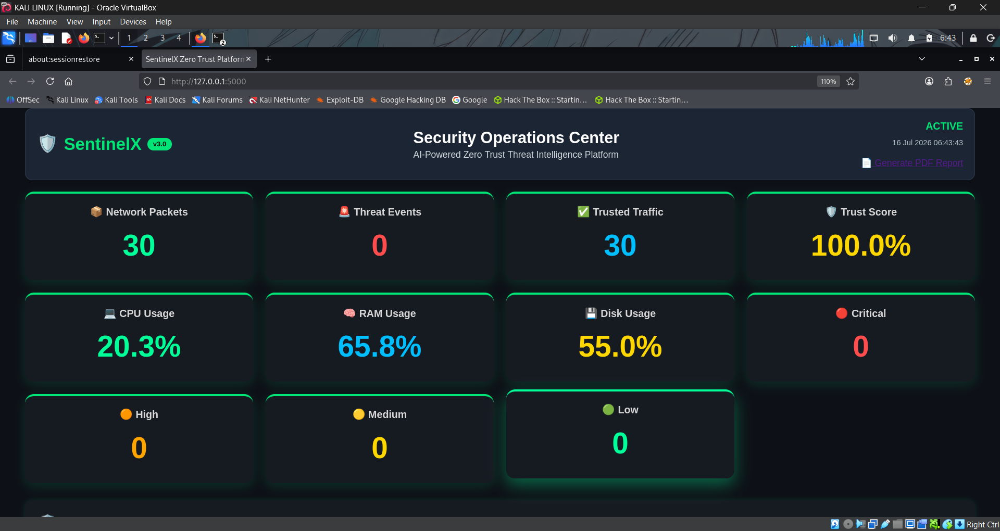
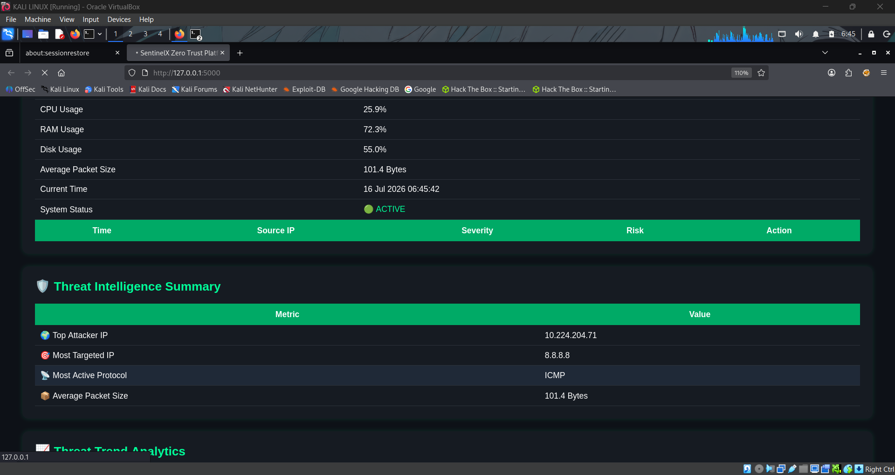
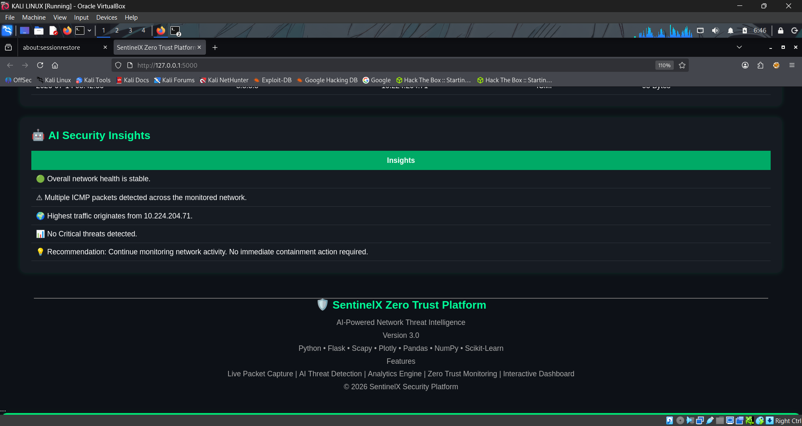
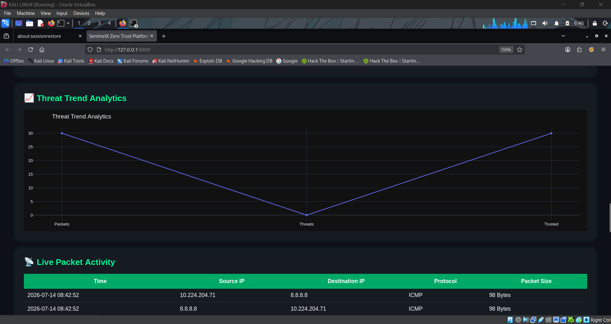
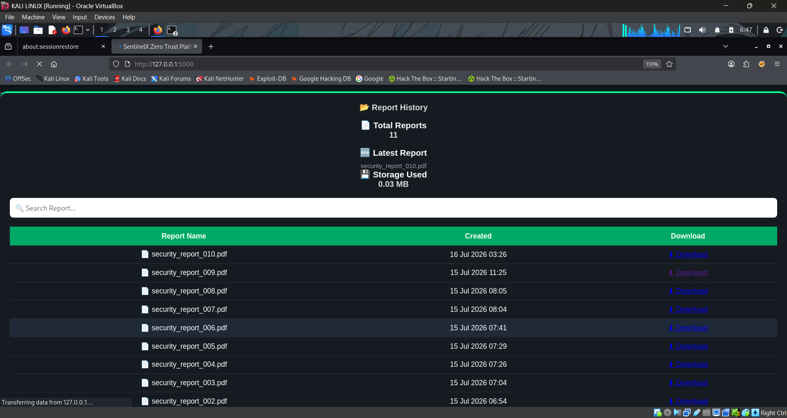
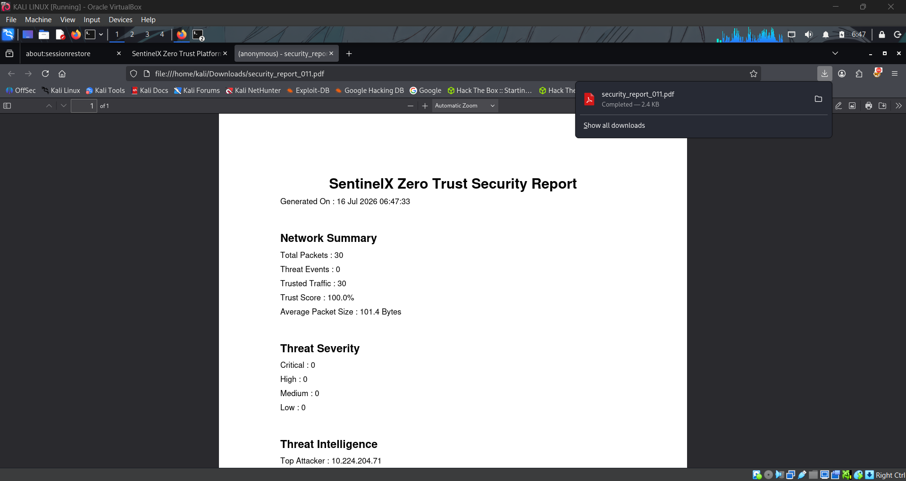

# 🛡 SentinelX — Zero Trust Network Threat Detection Platform

<p align="center">


</p>

SentinelX captures live network traffic, extracts flow-level features, and uses machine learning to flag anomalous activity — then surfaces the results through a Flask SOC-style dashboard with PDF reporting.

This isn't a tutorial clone. The detection pipeline was evaluated against real captured traffic (85,896 benign packets from normal browsing, 54,760 attack packets from live Nmap scans and a SYN flood against an isolated Docker target), and the results — including where the model performs poorly — are documented below rather than hidden.

---

## 📊 Evaluation Results

Full methodology, confusion matrices, and feature importances are in [`RESULTS.md`](RESULTS.md). Summary:

| Model | Precision | Recall | F1 | False Positive Rate |
|---|---|---|---|---|
| Isolation Forest (unsupervised, trained on benign traffic only) | 0.980 | 0.999 | 0.990 | **0.415** |
| Random Forest (supervised baseline) | 1.000 | 0.999 | 1.000 | 0.000 |

**Honest takeaway:** Isolation Forest's precision/recall look strong, but that's partly an artifact of class imbalance (the test set is ~95% attack flows). The number that actually matters operationally is the **41.5% false-positive rate** — in a real SOC, that volume of false alarms would be unusable. A supervised Random Forest, trained with labels, closes that gap entirely (0% FPR) but requires labeled attack data that isn't always available in production. This tradeoff — and what it implies about deploying unsupervised detection alone — is the core finding of this project.

Top predictive features (Random Forest): `pkts_per_sec`, `avg_pkt_size`, `bytes_per_sec`, `duration` — consistent with how port scans and floods actually look at the flow level (many short, uniform packets) versus normal browsing (longer, variable sessions).

---

## 🚀 Quick Start (Docker)

```bash
git clone https://github.com/rajeshrjjohn/SentinelX-Zero-Trust-Platform.git
cd SentinelX-Zero-Trust-Platform
git checkout v2
docker-compose up -d --build
```

Open **http://localhost:5000**. That's it — no manual dependency installation.

To stop: `docker-compose down`

---

## 🧪 Running the Tests

```bash
pip install -r requirements-dev.txt
python -m pytest tests/ -v
```

30 tests covering the detection engine, the trained model's feature contract, and the dashboard's analytics/monitor/threat modules. These run automatically on every push via [GitHub Actions](.github/workflows/tests.yml).

---

## ⚙️ Native Installation (without Docker)

```bash
git clone https://github.com/rajeshrjjohn/SentinelX-Zero-Trust-Platform.git
cd SentinelX-Zero-Trust-Platform
git checkout v2
python3 -m venv venv && source venv/bin/activate
pip install -r requirements.txt
python -m sentinelx.dashboard.app
```

To run live packet capture (requires root/raw-socket privileges, host-only — see *Design Notes* below):

```bash
sudo python3 -m sentinelx.collector.packet_capture
```

To retrain the anomaly model on your own captured traffic:

```bash
python3 -m sentinelx.detector.train_model
```

To reproduce the flow-based evaluation in `RESULTS.md` from raw pcaps:

```bash
python3 scripts/build_flows.py data/processed/benign_packets.csv data/processed/attack_packets.csv data/processed/flows.csv
python3 scripts/evaluate.py data/processed/flows.csv
```

---

## ✨ Features

- **Live packet capture** (Scapy) with per-packet protocol, size, and source/destination logging
- **Two-stage anomaly detection**: an Isolation Forest model flags deviations; a rule-based severity classifier (`classify_threat`) assigns risk scores and recommended actions (ALLOW / MONITOR / BLOCK)
- **Flow-level evaluation pipeline**: raw pcap → 5-tuple flows → engineered features (duration, packet/byte rates, SYN/ACK/RST counts, unique destination ports) → labeled precision/recall/FPR metrics
- **Flask SOC dashboard**: live traffic table, threat counters, protocol distribution, trust score, system health (CPU/RAM/disk via `psutil`), and Plotly charts
- **Automated PDF reporting** (ReportLab) with executive summary, threat intelligence, and numbered report history
- **Containerized** with Docker + docker-compose for one-command deployment
- **CI-tested**: 30 pytest tests run automatically on every push

---

## 🏗 Architecture

```text
Live Network (eth0)                 Isolated Docker Target
        │                                    │
        ▼                                    ▼
  Scapy Capture                     tcpdump (lab attacks:
        │                           nmap, hping3 SYN flood)
        ▼                                    │
 traffic_logger.py                           ▼
        │                         data/raw/*.pcap
        ▼                                    │
 live_detector.py                            ▼
 (Isolation Forest +             scripts/build_flows.py
  rule-based severity)            (5-tuple flow features)
        │                                    │
        ▼                                    ▼
   alerts.log                     scripts/evaluate.py
        │                      (Isolation Forest vs
        ▼                       Random Forest, metrics)
 Flask Dashboard                            │
 (sentinelx/dashboard)                      ▼
        │                              RESULTS.md
        ▼
   PDF Reports
```

Two parallel paths: the **left path** is the live product (capture → detect → dashboard → report), currently using a lightweight 2-feature model (`packet_length`, `protocol`) for real-time speed. The **right path** is the offline evaluation pipeline used to rigorously measure detection quality with richer flow-level features, documented in `RESULTS.md`. Closing that gap — bringing the flow-level features into live detection — is the natural next step (see *Roadmap*).

---

## 📂 Project Structure

```text
SentinelX-Zero-Trust-Platform/
├── sentinelx/
│   ├── collector/        # Live packet capture + CSV logging
│   ├── detector/         # Isolation Forest model + live inference
│   ├── dashboard/        # Flask app, templates, static assets, analytics
│   ├── reporting/        # PDF/text report generation
│   ├── zerotrust/        # Trust score engine
│   └── config.py         # Central path configuration
├── scripts/
│   ├── build_flows.py    # pcap → labeled flow features
│   └── evaluate.py       # Trains/evaluates IF + RF, writes RESULTS.md
├── tests/                # 30 pytest tests (detector, model, dashboard utils)
├── models/                # Trained anomaly_model.pkl
├── data/                  # Sample network data (live captures gitignored)
├── .github/workflows/     # CI (GitHub Actions)
├── Dockerfile
├── docker-compose.yml
├── requirements.txt       # Runtime dependencies
├── requirements-dev.txt   # + pytest for development
└── RESULTS.md              # Full evaluation methodology and metrics
```

---

## 🔍 Design Notes & Limitations

- **Live detection vs. offline evaluation use different feature sets.** The real-time detector (`live_detector.py`) uses only `packet_length` and `protocol` for speed; the evaluation pipeline (`scripts/evaluate.py`) uses 11 flow-level features and is more accurate. Bringing flow-level features into live detection is planned (see Roadmap).
- **Packet capture runs on the host, not in Docker.** Raw socket access for live sniffing needs host networking and elevated privileges that don't containerize cleanly; the Dockerized dashboard is for the web UI only. This is a deliberate scope decision, not an oversight.
- **Benign and attack traffic were captured on different interfaces** (`eth0` for benign host traffic, `docker0` for lab attacks against an isolated container), which could introduce confounding factors unrelated to attack behavior. Interface-sensitive features were excluded from the model for this reason.
- **The attack set is dominated by port-scan flows**, which skews the class balance. See `RESULTS.md` for the full discussion of how this affects precision/recall interpretation.
- **Isolation Forest's 41.5% false-positive rate is not production-ready** as a standalone detector. It's included deliberately as an honest baseline, not a polished result — the comparison against the supervised Random Forest is the point.

---

## 🗺 Roadmap

- [ ] Bring flow-level features (not just packet_length/protocol) into live detection
- [ ] Tune Isolation Forest contamination/feature subset to reduce false-positive rate
- [ ] Add IPv6 support to packet capture (currently IPv4-only)
- [ ] SSH brute-force flow capture (Hydra) as an additional attack class
- [ ] REST API for programmatic access to alerts
- [ ] Basic authentication for the dashboard

---

## 👨‍💻 Author

**Rajesh K**
Cybersecurity Analyst (CEH v13) — SOC Operations, VAPT, AI-driven Threat Detection

- GitHub: [github.com/rajeshrjjohn](https://github.com/rajeshrjjohn)
- LinkedIn: [linkedin.com/in/rajeshrjjohn](https://linkedin.com/in/rajeshrjjohn)
- Published research: *Adversarial Attack Detection in ML-Based Cybersecurity*, IJRASET Vol. 14 (DOI: 10.22214/ijraset.2026.79975)

---

## 📜 License

MIT License — see [LICENSE](LICENSE).

---

## 📸 Screenshots

### Dashboard Overview


### Threat Intelligence


### AI Security Insights


### Threat Trend Analysis


### Report History


### PDF Report

